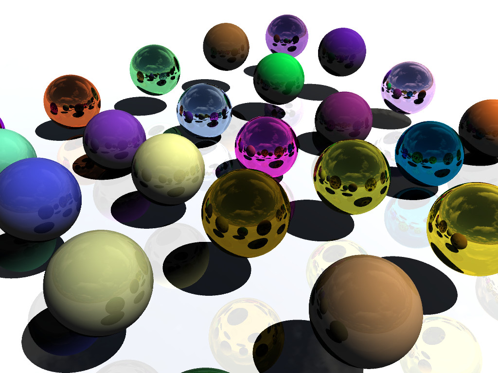

# vulkan-ray-tracing

The ray tracing code is based on this [blogpost](http://blog.three-eyed-games.com/2018/05/03/gpu-ray-tracing-in-unity-part-1/).
My first attempt at using Vulkan, the ray tracing algorithm is still very basic.
 - The ray tracing algorithm is executed for each pixel in a compute shader
 - The compute shader writes the color result in a texture
 - The graphics pipeline merely renders the texture on the screen

## Dependencies
To compile this project, you will need the following libraries
 - Vulkan
 - GLFW
 - stbi (for image loading)

